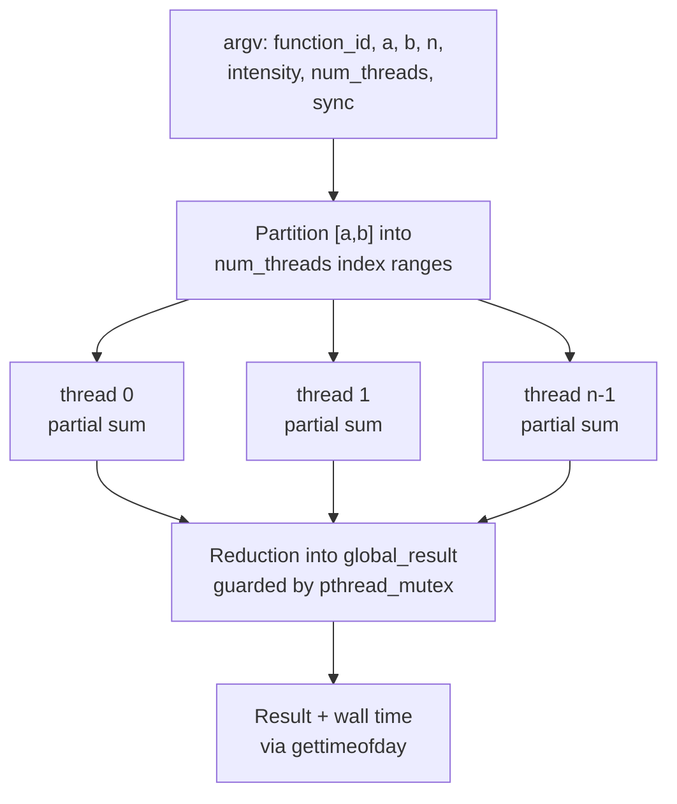

# Linux Systems Programming in C

POSIX threads, shared-state synchronization, parallel speedup measurement, and manual heap management — written in C on Linux and built with make.

## Overview

University of Delaware coursework: **CISC 361, Operating Systems (Fall 2024)**. Three pieces of work that together cover the parts of systems programming that matter in practice — creating and joining threads, protecting shared state, measuring whether parallelism actually bought anything, and managing heap memory by hand without leaking it.

The centrepiece is a parallelized numerical integration benchmark: the same computation run across a sweep of thread counts and problem sizes, with the resulting speedup data collected by shell scripts and plotted.

## Software / Tools

- **C** (C99), **POSIX threads** (`pthread_create`, `pthread_join`, `pthread_mutex_*`)
- **GCC**, **make** (multi-target Makefiles: build, run, clean)
- **Bash** for parameter sweeps, benchmark orchestration and result collection
- **gnuplot** for speedup plots
- **GDB** for step-through debugging

## What's Here

### `parallel-scheduler/` — Parallel numerical integration with speedup analysis

The real project. A definite integral is evaluated numerically over `n` intervals, with a configurable per-sample "intensity" knob that controls how much CPU work each sample costs. The work is partitioned across a configurable number of pthreads; each thread accumulates over its own index range, and results are combined under a selectable synchronization strategy.



Both a `sequential/` reference implementation and the `static/` threaded version are included, because a parallel speedup number is meaningless without the serial baseline it is measured against. The shell harness (`run_static.sh`, `bench_sequential.sh`, `params.sh`, `test.sh`, `plot.sh`) sweeps thread counts `{1,2,4,8,12}` against problem sizes `{1, 100, 10000, 1000000}`, writes timing results, and generates the speedup-vs-threads and speedup-vs-iterations plots.

### `pthreads-intro/` — Thread creation and mutual exclusion

A minimal, correct pthreads program: allocate `n` thread handles, give each its own parameter struct (avoiding the classic bug of sharing one loop variable across threads), create, join, and serialize output through a mutex so interleaved `printf` calls don't garble. Error handling on both `pthread_create` and `pthread_join`, and explicit cleanup of both the heap allocation and the mutex.

### `linked-list-memory-management/` — Dynamic allocation in C

An interactive singly-linked-list record manager (insert, display, delete, reverse) built on `malloc`/`free` with `char*` fields allocated per node. The point of the exercise is ownership: `freeList()` walks the list freeing the string inside each record *before* freeing the record itself, and reports the count — get that order wrong and you leak or double-free. The list skeleton was adapted from course-provided starter code; the insert/delete/reverse/free logic and the I/O handling are mine.

## Key Engineering Work

- **Per-thread parameter structs.** Each thread receives a pointer to its own `struct Params` with its index range, so there is no shared mutable loop state and no race on thread arguments.
- **Explicit critical section.** The reduction into `global_result` is the only shared write, and it is the only thing under the mutex — keeping the lock scope minimal is what allows speedup to show up at all.
- **A tunable work knob.** The `intensity` parameter exists so the benchmark can move between "dominated by thread overhead" and "dominated by real computation." Without it, small problem sizes show parallel *slowdown* and the measurement teaches nothing.
- **Defensive input handling** in the interactive list program — `scanf`/`fgets` return values are checked, and trailing newlines are stripped rather than being silently stored in the record.

## Testing / Validation

- **Baseline-relative measurement.** Every parallel timing is divided by the sequential timing for the same parameters; raw wall-clock numbers are never reported as speedup on their own.
- **Two-dimensional sweep.** Results were collected across both thread count and iteration count, which is what exposes the overhead-dominated regime at small `n` and diminishing returns past the core count.
- **Automated regression** via `test.sh` over the full parameter matrix.
- **Plots generated from collected data** (`plot.sh`) rather than from hand-picked runs.

Raw result files and generated plots are excluded via `.gitignore`, since they are machine-specific output rather than source.

## Repository Structure

```
parallel-scheduler/
  static/        static_sched.c + Makefile + benchmark and plotting scripts
  sequential/    sequential.c + Makefile + baseline benchmark script
pthreads-intro/  hello_thread.c + Makefile
linked-list-memory-management/
                 main.c, add.c, freeList.c, print.c, mp3.h, Makefile
```

Build any component with `make` in its directory.

## What I Learned

Measuring parallel performance honestly is harder than writing the parallel code. My first speedup numbers looked wrong because the computation was too cheap relative to thread creation — at `n=1` and 12 threads the program is slower than the serial version, and that is the correct answer, not a bug. Adding a deliberate intensity parameter and sweeping two dimensions instead of one is what turned a confusing result into a readable curve.

The other lesson was lock scope. An early version held the mutex around more than the reduction, and the speedup curve went flat. Shrinking the critical section to the single shared write was a one-line change with a visible effect on the plot — a concrete demonstration of why contention, not thread count, sets the ceiling.

## Academic Context

University of Delaware, CISC 361 — Operating Systems, Fall 2024. Programming Assignments 1 and 3. Course-provided starter skeletons are noted above where used; the concurrency, benchmarking and memory-management implementations are my own.
